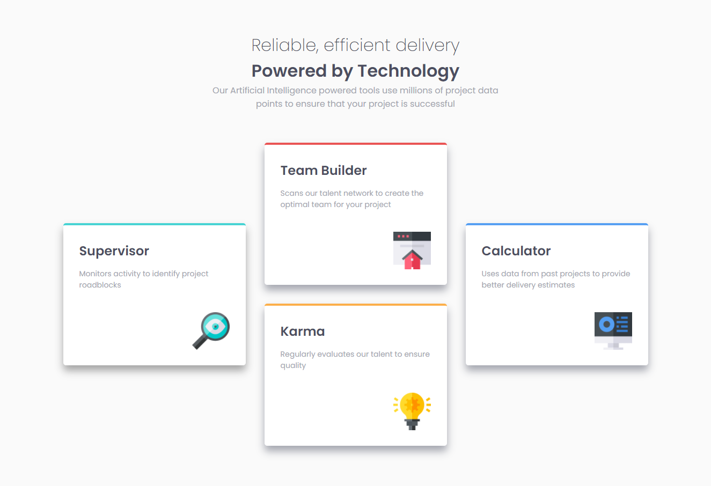

# Frontend Mentor - Four card feature section solution

This is a solution to the [Four card feature section challenge on Frontend Mentor](https://www.frontendmentor.io/challenges/four-card-feature-section-weK1eFYK). Frontend Mentor challenges help you improve your coding skills by building realistic projects. 

## Table of contents

- [Overview](#overview)
  - [The challenge](#the-challenge)
  - [Screenshot](#screenshot)
  - [Links](#links)
- [My process](#my-process)
  - [Built with](#built-with)
  - [What I learned](#what-i-learned)
  - [Useful resources](#useful-resources)
- [Author](#author)

## Overview

### The challenge

In this challenge, I thought it was going to be easier. In part of position the cards was very hard for me, since I worked with it only once. Well, Next you see the screenshots of the challenge.

### Screenshot

### Links

- Solution URL: [No link yet]()
- Live Site URL: [4_Cards](https://emilyfelicio.github.io/4_Cards/)

## My process

### Built with

- HTML
- CSS3
- CSS Grid
- Media-Query

### What I learned

I learned better how to manage the media query and my time. This result came out in 4 hours (or close to that, I don't remember).
The most difficult and time-consuming part was the question of positioning. the solution was to make several small columns and the same thing with the rows, doing this we could continue with the construction process.

### Useful resources

- [W3Schools - Grid CSS](https://www.w3schools.com/css/css_grid.asp) - Like my other challenge, I recommend to those who still don't know how to use the 'display: grid', to read this article from W3Schools.

## Author

- GitHub - [My GitHub Profile](https://github.com/EmilyFelicio)
- Frontend Mentor - [@yourusername](https://www.frontendmentor.io/profile/EmilyFelicio)
